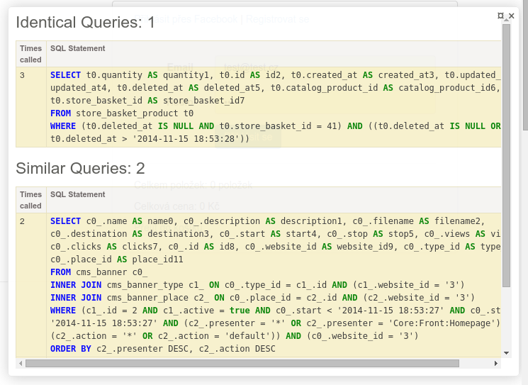

# Doctrine Query Stats 

[](https://travis-ci.org/Zenify/DoctrineQueryStats)
[](https://scrutinizer-ci.com/g/Zenify/DoctrineQueryStats)
[](https://scrutinizer-ci.com/g/Zenify/DoctrineQueryStats)
[](https://packagist.org/packages/zenify/doctrine-query-stats)
[](https://packagist.org/packages/zenify/doctrine-query-stats)

Implementation of [DoctrineQueryStatisticsBundle](https://github.com/sensiolabs/SensioLabsDoctrineQueryStatisticsBundle) in Nette.


## Install

Via Composer:

```sh
$ composer require zenify/doctrine-query-stats --dev
```

Register extension in `config.neon`:

```yaml
extensions:
	- Zenify\DoctrineQueryStats\DI\DqsExtension
```


## Usage

For duplicate queries now you can see overview in debug bar:
	

