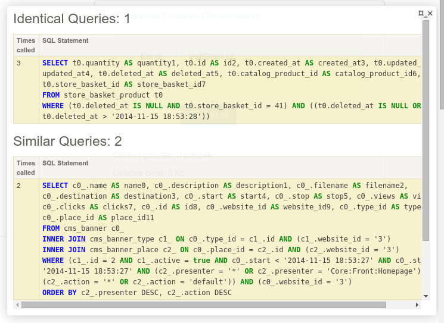

# Lekarna/DoctrineQueryStats 

[](https://packagist.org/packages/lekarna/doctrine-query-stats)
[](https://packagist.org/packages/lekarna/doctrine-query-stats)

Implementation of [DoctrineQueryStatisticsBundle](https://github.com/sensiolabs/SensioLabsDoctrineQueryStatisticsBundle) in Nette.


## Usage

Install latest version via composer:

```sh
$ composer require lekarna/doctrine-query-stats
```

Register extension in `config.neon`:

```yaml
extensions:
	- Lekarna\DoctrineQueryStats\DI\DqsExtension
```

For duplicate queries now you can see overview in debug bar:
	

